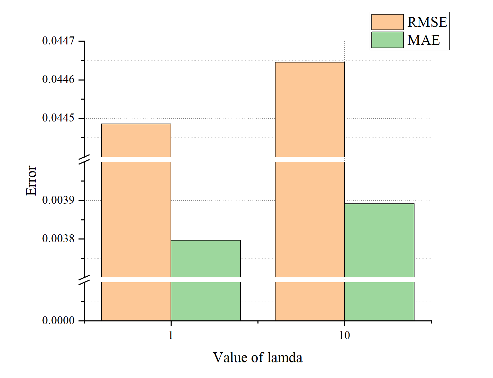
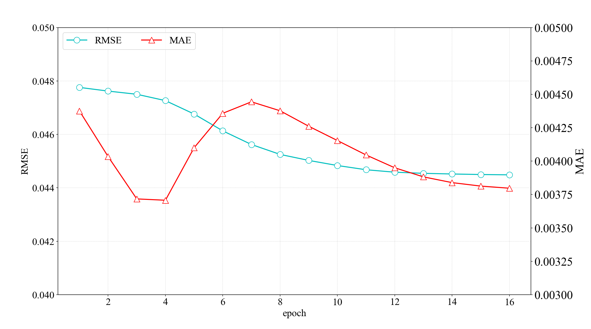
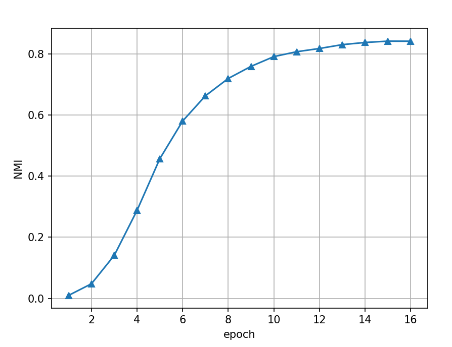
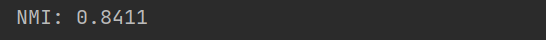

# SNCMF

This repository is an official MindSpore implementation of our paper "Symmetry and nonnegativity-constrained matrix factorization for community detection". (*IEEE/CAA Journal of Automatica Sinica, 2022*). [[download](https://ieeexplore.ieee.org/abstract/document/9865020)]


## Prerequisites:

1. MindSpore 2.1.1
2. numpy
3. sklearn


## Dataset
All datasets used in this Paper are follows.

|  Datasets   | Nodes  |  Edges  | Communities |    Description     |
| :---------: | :----: | :-----: | :---------: | :----------------: |
|   Youtube   | 11,144 | 36,186  |     40      |   Youtube online   |
| Friendster  | 11,023 | 280,755 |     13      | Friendster online  |
| LiveJournal | 7,181  | 253,820 |     30      | LiveJournal online |
|    Orkut    | 11,751 | 270,667 |      5      |    Orkut online    |
|   Amazon    |  5304  |  16701  |     85      |   Amazon product   |
|    DBLP     | 12,547 | 35,250  |      4      | DBLP collaboration |

## Results
"RMSE & MAE with value of lambda"
<p align="center">

</p>

"RMSE & MAE convergence curve"
<p align="center">

</p>

"NMI convergence curve"
<p align="center">

</p>

"NMI"
<p align="center">

</p>

## Citation

If you find our paper useful in your research, please consider citing:

```
@article{liu2022symmetry,
  title={Symmetry and nonnegativity-constrained matrix factorization for community detection},
  author={Liu, Zhigang and Yuan, Guangxiao and Luo, Xin},
  journal={IEEE/CAA Journal of Automatica Sinica},
  volume={9},
  number={9},
  pages={1691--1693},
  year={2022},
  publisher={IEEE}
}
```
